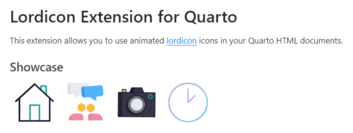

# Lordicon Extension for Quarto

This extension provides support for embedding animated icons from Lordicon into Quarto HTML files (including RevealJS presentations). The icons can be pulled directly from the official CDN or loaded via local .json files; they can also be customized in appearance on-the-fly (without needing to edit the .json files).

## Examples

[](https://jmgirard.github.io/lordicon/example.html)

- View example code and previews in this [HTML Demo](https://jmgirard.github.io/lordicon/example.html)!
- Intermediate: Learn about [CSS Styling](https://jmgirard.github.io/lordicon/css_styling.html)
- Intermediate: Learn about [Animations](https://jmgirard.github.io/lordicon/animations.html)
- Advanced: Learn about [Targets](https://jmgirard.github.io/lordicon/targets.html)

## Installing

```
$ quarto add jmgirard/lordicon
```

This will install the extension under the `_extensions` subdirectory. If you're using version control, you will want to check in this directory.

## Using

To embed an icon from the CDN, use the `` shortcode. For example:

```


```

Look up an icon's `code` by browsing [lordicon.com](https://lordicon.com/icons), clicking on an icon and choosing Export > Embed HTML.

---

To embed an icon from a local .json file, use the `` shortcode. For example:

```


```

Download an icon's .json file by browsing [lordicon.com](https://lordicon.com/icons), clicking on an icon, and choosing Export > JSON (Lottie).

---

You can also customize various aspects of the icon's appearance and animation. See the examples above.

## Note

In order for the icons to appear properly in your RStudio Viewer pane, you need to update to RStudio version 2022.12.0+353 or newer. You can still use older versions of RStudio, but to view your icons you will need to view the rendered HTML files in an external browser.
