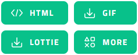

# Lordicon Extension for Quarto

This extension provides support for embedding icons from Lordicon into Quarto HTML files (including RevealJS presentations). The icons can be pulled directly from the official CDN or loaded via local .json files; they can also be customized in appearance on-the-fly (without needing to edit the .json files).

## Installing

```
$ quarto install extension jmgirard/lordicon
```

This will install the extension under the `_extensions` subdirectory. If you're using version control, you will want to check in this directory.

## Using

To embed an icon from the CDN, use the `` shortcode. For example:

```


```

Look up an icon's `code` by browsing [lordicon.com](https://lordicon.com/icons), clicking on an icon you like, going to the sidebar, and clicking on the HTML button (see Figure 1). The `code` is displayed at the bottom left of the modal and can be copied to the clipboard by clicking it (see Figure 2).

| Figure 1              | Figure 2           |
|:---------------------:|:------------------:|
|  |  |

---

To embed an icon from a local .json file, use the `` shortcode. For example:

```


```

Download an icon's .json file by browsing [lordicon.com](https://lordicon.com/icons), clicking on an icon you like, going to the sidebar, and clicking on the LOTTIE button (see Figure 1). This will download the file, which you can move and rename as desired.

---

You can also customize various aspects of the icon's appearance, such as the animation trigger, delay, speed, colors, stroke, scale, and position (see the [HTML example](https://jmgirard.github.io/lordicon/example.html) to see these options in action). 

Icons sizes are controlled by setting CSS for `lord-icon` HTML elements:

```
lord-icon {
  width: 128px;
  height: 128px;
}
```

To style groups of icons, you can pass each icon a CSS class via the shortcode's `class` argument (e.g., ``).

```
lord-icon.small {
  width: 48px;
  height: 48px;
}
```

## Example

Here is the source code for a minimal example: [example.qmd](https://github.com/jmgirard/lordicon/blob/main/example.qmd)

This is the output of `example.qmd` for [HTML](https://jmgirard.github.io/lordicon/example.html)

Note that there is currently a bug where the icons won't appear in the RStudio Viewer but will appear when the HTML file is opened in a modern browser. This issue will be resolved in the 2022-11 version of RStudio, which updates the Viewer to support newer JavaScript features. You can gain early access to this version of RStudio through the [daily builds](https://dailies.rstudio.com/).
