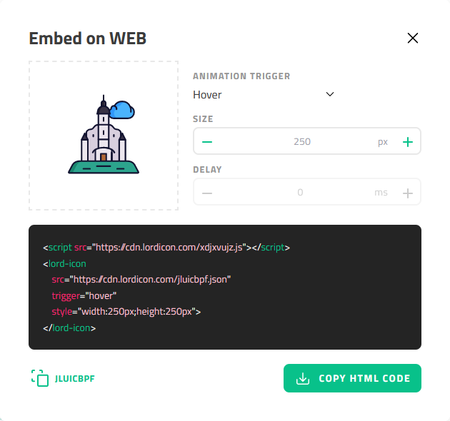

# Lordicon Extension for Quarto

This extension provides support including free icons provided by Lordicon. Icons can be used in HTML and Revealjs formats.

## Installing

```
$ quarto install extension jmgirard/lordicon
```

This will install the extension under the `_extensions` subdirectory. If you're using version control, you will want to check in this directory.

## Using

To embed an icon, use the `` shortcode. For example:

```



```

Look up the `code` for an icon by browsing [lordicon.com](https://lordicon.com/icons), clicking on an icon you like, going to the sidebar, and clicking on the HTML button. The `code` is displayed at the bottom left of the modal and can be copied to the clipboard using the COPY HTML CODE button (see screenshot of the modal below).



## Example

Here is the source code for a minimal example: [example.qmd](https://github.com/jmgirard/lordicon/blob/main/example.qmd)

This is the output of `example.qmd` for [HTML](https://jmgirard.github.io/lordicon/example.html)
